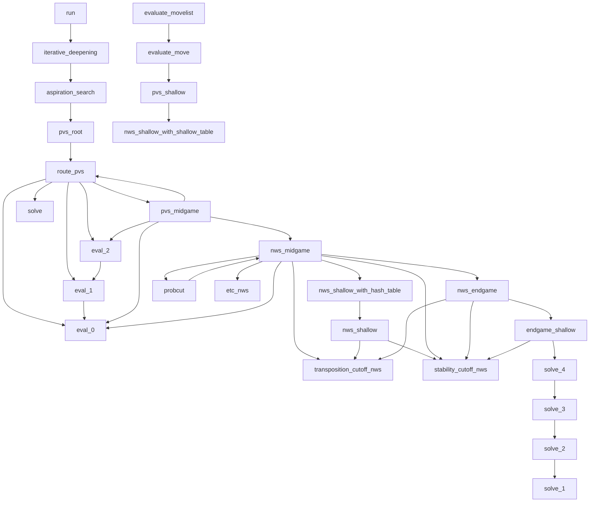

# Dependencies of `Search` functions

```mermaid
graph TD;
    run
    iterative_deepening
    aspiration_search
    pvs_root
    route_pvs
    pvs_midgame
    eval_0
    eval_1
    eval_2
    solve
    nws_midgame
    nws_shallow_with_hash_table
    nws_endgame
    transposition_cutoff_nws

    evaluate_movelist
    evaluate_move
    pvs_shallow
    nws_shallow_with_shallow_table

    evaluate_movelist-->evaluate_move;
    evaluate_move-->pvs_shallow;
    pvs_shallow-->nws_shallow_with_shallow_table;


    run-->iterative_deepening;
    iterative_deepening-->aspiration_search;
    aspiration_search-->pvs_root;
    pvs_root-->route_pvs;
    route_pvs-->solve;
    route_pvs-->pvs_midgame;
    route_pvs-->eval_2;
    route_pvs-->eval_1;
    route_pvs-->eval_0;
    eval_2-->eval_1;
    eval_1-->eval_0;
    pvs_midgame-->eval_2;
    pvs_midgame-->eval_0;
    pvs_midgame-->route_pvs;
    pvs_midgame-->nws_midgame;

    nws_shallow-->stability_cutoff_nws;

    nws_shallow_with_hash_table-->nws_shallow;

    nws_midgame-->eval_0;
    nws_midgame-->nws_shallow_with_hash_table;
    nws_midgame-->stability_cutoff_nws;
    nws_midgame-->transposition_cutoff_nws;
    nws_midgame-->probcut;
    nws_midgame-->etc_nws;
    nws_midgame-->nws_endgame;
    nws_shallow-->transposition_cutoff_nws;


    nws_endgame-->stability_cutoff_nws;
    nws_endgame-->endgame_shallow;
    nws_endgame-->transposition_cutoff_nws;

    endgame_shallow-->stability_cutoff_nws;
    endgame_shallow-->solve_4;

    solve_4-->solve_3;
    solve_3-->solve_2;
    solve_2-->solve_1;

    probcut-->nws_midgame;
```
